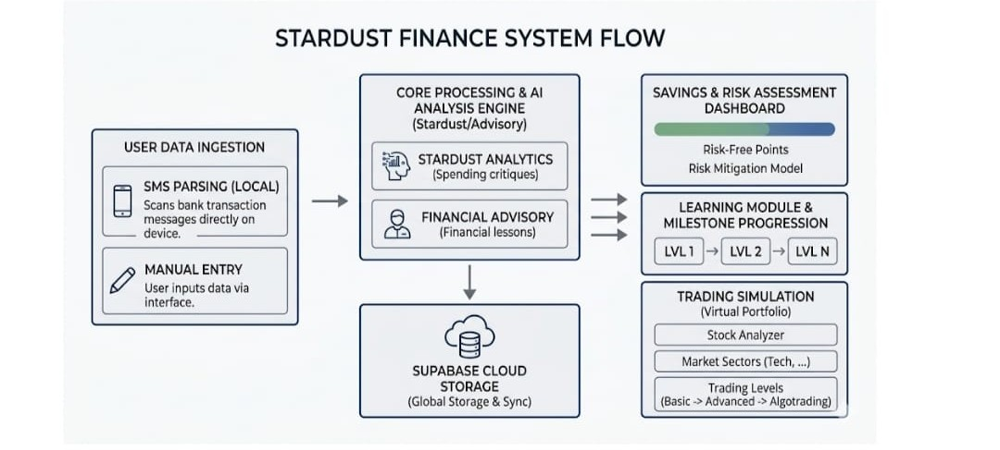

# Stardust

A gamified financial literacy and trading simulation mobile application designed to make learning market mechanics interactive and engaging.

## 📸 Application Overview

| Market Dashboard | Trading Simulation |
| :---: | :---: |
| <div align="center"></div> | <div align="center"></div> |
| **Portfolio Analysis** | **Financial Literacy Modules** |
| <div align="center"></div> | <div align="center"></div> |

---


### Tech Stack
*   **Frontend:** Flutter, Dart
*   **Native Android:** Kotlin
*   **State Management:** Riverpod
*   **Backend & Database:** Supabase

---
## 🏗️ Technical Architecture

<div align="center"></div>

## ✨ Key Features

*   **Gamified Trading Simulation:** Real-time simulated market environment for practicing investment strategies without financial risk.
*   **Automated Expense Tracking:** Parses incoming bank SMS alerts automatically to categorize and track daily income and expenses.
*   **AI-Powered Stock Analyzer:** Integrates an AI API to provide real-time insights, metrics, and predictive analysis on stock performance.
*   **Interactive Chatbot Personas:** Multiple AI-driven financial advisors, each with distinct personalities, to guide users through market mechanics and financial planning.
*   **Financial Literacy Modules:** Interactive educational tracks designed to build core financial knowledge.
*   **Immersive Audio Feedback:** Integrated background music and analytical sound effects to enhance the gamified experience.
*   **Secure Cloud Sync:** Real-time portfolio and progress tracking backed by Supabase PostgreSQL and authentication.

---

## 🧠 Engineering Highlights

*   **Cross-Platform Architecture:** Engineered a responsive, high-performance mobile application using Flutter, ensuring consistent behavior across devices.
*   **On-Device Data Extraction:** Built secure, native-level SMS parsing mechanics to read and categorize financial transactions locally without compromising user privacy.
*   **AI & API Orchestration:** Seamlessly integrated external AI APIs to power real-time stock analysis and maintain contextual memory for multi-persona interactive chatbots.
*   **Advanced State Management:** Implemented Riverpod to cleanly decouple the presentation layer from the complex trading logic, dynamic chatbot states, and Supabase backend services.
*   **Asset Pipeline Optimization:** Structured a clean asset pipeline for dynamic media delivery, including high-density Android icons and immersive audio tracks.

## 🚀 Local Development Setup

To run this project locally, ensure you have the Flutter SDK, Android Studio, and a Supabase project configured.

### 1. Clone the Repository
```bash
git clone https://github.com/mathewan10y/stardust.git
cd stardust
```
### 2. Install Dependencies
Get the Flutter packages required for the project:
```bash
flutter pub get
```
### 3. Environment Configuration
Create a .env file in the root directory to securely store your Supabase credentials:
```plaintext
SUPABASE_URL=your_supabase_project_url
SUPABASE_ANON_KEY=your_supabase_anon_key
```
### 4. Run the Application
Start the application on a connected device or emulator:
```bash
flutter run
```